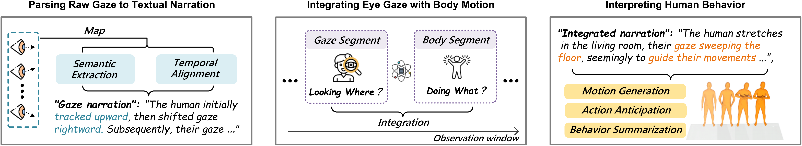
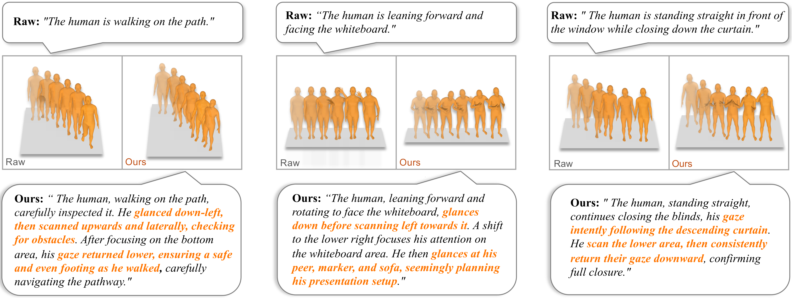

# GazeInterpreter: Parsing Eye Gaze to Generate Eye-Body-Coordinated Narrations

Official repository for the paper: "GazeInterpreter: Parsing Eye Gaze to Generate Eye-Body-Coordinated Narrations" (AAAI 2026)

## Introduction 

GazeInterpreter is a novel framework that integrates symbolic gaze events and human motion to generate eye-body-coordinated narrations,
which can significantly enhance a range of HCI tasks including motion generation, action anticipation, and behavior summarization.

---

## 📌 Overview
In this project, we provide:
- Download Data & Pre-Process  
- Workflow Conda Environment  
- Run the Workflow 
- Qualitative Results 

---

## 1. 📥 Download Data & Pre-Process

### 1-1: Dataset environment setup
We use the large-scale human motion dataset: Nymeria. 
Follow the dataset conda environment instructions from the official [repository](https://github.com/facebookresearch/nymeria_dataset).

It is recommended to directly download the nymeria repository to the ./data_preproces directory.

### 1-2: Download the required data 
We need to download the scenes including gaze and motion, use Nymeria official download and filtering tools:
```
conda activate pymeria
cd data_preprocesss/nymeria_dataset

# The json we provide for download includes all scenes that contain both gaze and motion narration
python download.py -i ../nymeria_download_urls.json -o <your_save_path> 
```
The structure of the downloaded files is as follows:
```
your_save_path/
├── <scene>/
│   └── <body>/
│   └── <narration>/
│   └── <recording_head>/
│   └── ...
├── <scene>/
│   └── ...
...
```
### 1-3: Data preprocessing 
Use the script we provided to extract raw gaze data and convert them into symbolic events:

```bash
# First modify the custom configuration in the file, e.g., 'data_dir' and 'output_dir'
python data_preprocess/symbolic_gaze_usage_example.py 
```

Data structure after processing completed：
```
your_output_dir/
├── preprocessed/
│   └── <scene>.npy
├── symbolic_gaze/
│   └── <scene>.json
├── personalized_gaze/
│   └── <scene>/motion_id_XXXX.npy
└── general_gaze/
    └── <scene>/motion_id_XXXX.npy
```
---

## 2. 🛠 Workflow Conda Environment
Next, create a virtual environment where GazeInterpreter runs:
### 2-1: Dataset environment setup
```
conda create -n gaze2text python=3.10
conda activate gaze2text
```
Install dependencies:
```
pip install -r requirements.txt
```
### 2-2: (Optional) Local LLM setup
If you want to run the system without API calls, you can download the local LLM weights.

We provide a script for easy download of Google/Gemma models:
```
conda activate gaze2text

python deployment_gemma_local/download_model.py \
  --output_dir ./models/gemma-3-4b-it
  
# Import environment variables
export GEMMA_LOCAL_MODEL_PATH=$(realpath ./models/gemma-3-4b-it) 
```
---

## 3. 🚀 Run the Workflow
After preprocessing data and setting up workflow environment:
```
conda activate gaze2text

python workflow/main.py \
  --llm_provider gemini \
  --api_key "$YOUR API KEY" \
  --input_path "$YOUR_SYMBOLIC_GAZE_PATH" \
  --output_path "$YOUR_OUTPUT_PATH"
```
If using local LLM inference:
```
python workflow/main.py \
  --llm_provider gemma_local \
  --model_path "$GEMMA_LOCAL_MODEL_PATH" \
  --input_path "$YOUR_SYMBOLIC_GAZE_PATH" \
  --output_path "$YOUR_OUTPUT_PATH"
```
(Optional) An additional script for multi-process inference is provided:
```
# First modify the custom configuration in the file
python run_parallel_batches.py
```
---
## 📈 Results


---
## Acknowledgments
Thanks to [nymeria](https://github.com/facebookresearch/nymeria_dataset),
[projectaria_tools](https://github.com/facebookresearch/projectaria_tools),
and [gemma](https://github.com/google-deepmind/gemma),
our code is partially borrowing from them.

[//]: # (## Citation)

[//]: # (If our paper and code are beneficial to your work, please consider citing:)
